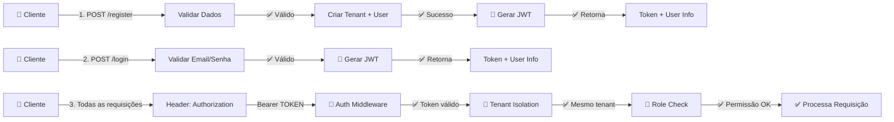

# 🚀 SaaS para Locadora

> Sistema robusto de gestão inteligente de locações de caçambas, containers e equipamentos para obras.

<div align="center">


**[Documentação](#-documentação) • [Quick Start](#-quick-start) • [API](#-api-endpoints) • [Arquitetura](#-arquitetura)**

</div>

---

## 📋 Sumário

- [Visão Geral](#-visão-geral)
- [Stack Tecnológico](#-stack-tecnológico)
- [Arquitetura](#-arquitetura)
- [Funcionalidades](#-funcionalidades)
- [Quick Start](#-quick-start)
- [Variáveis de Ambiente](#-variáveis-de-ambiente)
- [API Endpoints](#-api-endpoints)
- [Autenticação e Segurança](#-autenticação-e-segurança)
- [Estrutura de Pastas](#-estrutura-de-pastas)
- [Documentação](#-documentação)
- [Contribuindo](#-contribuindo)
- [Autor](#-autor)

---

## 🎯 Visão Geral

Uma solução SaaS completa para gerenciamento de locadoras de equipamentos (caçambas, containers) com:

- ✅ **Autenticação Segura** - JWT com tokens de 7 dias
- ✅ **Multi-tenant** - Isolamento completo de dados entre clientes
- ✅ **RBAC** - Controle de acesso por roles (admin/user)
- ✅ **Validação Robusta** - Schemas Zod type-safe
- ✅ **API REST** - 100% documentada com Swagger
- ✅ **Criptografia** - Senhas protegidas com bcryptjs
- ✅ **Escalabilidade** - Arquitetura em camadas bem definida

---

## 🛠 Stack Tecnológico

| Aspecto | Tecnologia |
|--------|-----------|
| **Linguagem** | TypeScript 6.0.3 |
| **Runtime** | Node.js |
| **Framework** | Express 5.2.1 |
| **ORM** | Sequelize 6.37.8 |
| **Banco de Dados** | MySQL 8.0 |
| **Validação** | Zod 4.4.3 |
| **Autenticação** | JWT + bcryptjs 3.0.3 |
| **Documentação** | Swagger 6.2.8 |
| **Containerização** | Docker + Docker Compose |

---

## 🏗 Arquitetura

O projeto segue a arquitetura **MVC em Camadas** (Layered Architecture):

```
┌─────────────────────────────────────────────────────────────┐
│                    Express Routes                            │
├─────────────────────────────────────────────────────────────┤
│         🔐 Middlewares (Auth, Validation, CORS)             │
├─────────────────────────────────────────────────────────────┤
│              Controllers (HTTP Handlers)                     │
├─────────────────────────────────────────────────────────────┤
│              Services (Business Logic)                       │
├─────────────────────────────────────────────────────────────┤
│              Models (Data Access Layer)                      │
├─────────────────────────────────────────────────────────────┤
│                   MySQL Database                             │
└─────────────────────────────────────────────────────────────┘
```

### 📁 Estrutura de Pastas

```
saas-locadora/src/
├── config/                 # Configurações (database, swagger)
│   ├── database.ts         # Conexão Sequelize
│   └── swagger.ts          # Setup Swagger
├── controllers/            # Handlers HTTP
│   ├── AuthController.ts    # Autenticação
│   ├── AssetController.ts   # Gestão de ativos
│   ├── CustomerController.ts
│   └── RentalController.ts
├── services/               # Lógica de negócio
│   ├── authService.ts
│   ├── assetService.ts
│   ├── customerService.ts
│   └── rentalService.ts
├── models/                 # Modelos Sequelize
│   ├── Tenant.ts           # Locadora
│   ├── User.ts             # Usuário (NEW)
│   ├── Asset.ts            # Caçambas/Containers
│   ├── Customer.ts         # Clientes
│   └── Rental.ts           # Locações
├── routes/                 # Definição de rotas
│   ├── authRoutes.ts       # Auth routes (NEW)
│   ├── assetRoutes.ts
│   ├── customerRoutes.ts
│   ├── rentalRoutes.ts
│   └── index.ts            # Agregador de rotas
├── schemas/                # Validação Zod
│   ├── authSchema.ts       # Auth validation (NEW)
│   └── ...
├── middlewares/            # Middlewares Express
│   ├── authMiddleware.ts   # JWT + Isolation (NEW)
│   └── validateRequest.ts  # Zod validation
└── server.ts               # Entry point
```

---

## 💡 Funcionalidades Principais

### 🔐 Autenticação e Autorização
- Registro de nova locadora + usuário admin
- Login com JWT
- Controle de acesso por roles (admin/user)
- Proteção contra acesso não autorizado
- Isolamento multi-tenant automático

### 📦 Gestão de Ativos
- Criar, listar, atualizar e deletar caçambas/containers
- Controle de status (disponível, alugado, manutenção)
- Filtros por status

### 👥 Gerenciamento de Clientes
- Registro de clientes
- Histórico de locações

### 📋 Controle de Locações
- Criar contratos de locação
- Itens da locação
- Controle de prazo

### 🛡️ Segurança
- Senhas criptografadas com bcryptjs
- Tokens JWT com expiração
- Isolamento de dados por tenant
- Validação de schemas em todos os endpoints

---

## 🚀 Quick Start

### Pré-requisitos
- Node.js 18+
- MySQL 8.0+
- npm ou yarn

### 1. Clone o repositório

```bash
git clone https://github.com/JPLA-DEVELOPER/saas-locadora.git
cd saas-locadora
```

### 2. Instale dependências

```bash
cd saas-locadora
npm install
```

### 3. Configure variáveis de ambiente

```bash
# Na raiz do projeto, crie um .env baseado em .env.example
cp .env.example .env
```

Edite `.env` com suas configurações:

```bash
DB_HOST=localhost
DB_PORT=3306
DB_NAME=locadora_db
DB_USER=root
DB_PASS=password123
PORT=3000
JWT_SECRET=sua-chave-super-secreta-aqui
```

### 4. Inicie o banco de dados

```bash
# Usando Docker Compose
docker-compose up -d

# Ou configure MySQL manualmente
mysql -u root -p
CREATE DATABASE locadora_db;
```

### 5. Inicie o servidor

```bash
npm run server
```

O servidor estará rodando em `http://localhost:3000`

📚 **Documentação API**: http://localhost:3000/api-docs

---

## 🔑 Variáveis de Ambiente

Crie um arquivo `.env` na raiz do projeto com as seguintes variáveis:

```bash
# Database
DB_HOST=localhost
DB_PORT=3306
DB_NAME=locadora_db
DB_USER=root
DB_PASS=password123

# Server
PORT=3000
NODE_ENV=development

# JWT
JWT_SECRET=sua-chave-super-secreta-mudando-em-producao
JWT_EXPIRATION=7d
```

⚠️ **Importante**: Nunca commit `.env` com dados sensíveis para Git!

---

## 📡 API Endpoints

### 🔐 Autenticação

| Método | Endpoint | Descrição | Autenticação |
|--------|----------|-----------|--------------|
| POST | `/api/auth/register` | Registrar nova locadora | ❌ Pública |
| POST | `/api/auth/login` | Fazer login | ❌ Pública |
| GET | `/api/auth/profile` | Obter perfil do usuário | ✅ JWT |
| POST | `/api/auth/change-password` | Alterar senha | ✅ JWT |
| POST | `/api/auth/users` | Criar novo usuário (admin) | ✅ JWT + Admin |

### 📦 Ativos

| Método | Endpoint | Descrição | Autenticação |
|--------|----------|-----------|--------------|
| POST | `/api/assets` | Criar novo ativo | ✅ JWT |
| GET | `/api/assets` | Listar ativos | ✅ JWT |
| PUT | `/api/assets/:id` | Atualizar ativo | ✅ JWT |
| DELETE | `/api/assets/:id` | Deletar ativo | ✅ JWT |

### 👥 Clientes

| Método | Endpoint | Descrição | Autenticação |
|--------|----------|-----------|--------------|
| POST | `/api/customers` | Criar cliente | ✅ JWT |
| GET | `/api/customers` | Listar clientes | ✅ JWT |

### 📋 Locações

| Método | Endpoint | Descrição | Autenticação |
|--------|----------|-----------|--------------|
| POST | `/api/rentals` | Criar locação | ✅ JWT |
| GET | `/api/rentals` | Listar locações | ✅ JWT |

**Documentação completa**: http://localhost:3000/api-docs (Swagger UI)

---

## 🔐 Autenticação e Segurança

### Fluxo de Autenticação



### Recursos de Segurança

- **JWT (JSON Web Tokens)**: Tokens seguros com expiração de 7 dias
- **bcryptjs**: Criptografia de senhas com salt
- **Multi-tenant**: Cada operação valida tenant_id
- **RBAC**: Roles admin/user com permissões distintas
- **Validação Zod**: Type-safe schema validation
- **Isolamento de dados**: Queries filtradas automaticamente por tenant_id

---

## 📚 Documentação

### Guias Disponíveis

- **[AUTH_GUIDE.md](./AUTH_GUIDE.md)** - Guia completo de autenticação
- **[README.md](./README.md)** - Este arquivo
- **[Swagger UI](http://localhost:3000/api-docs)** - Documentação interativa da API

### Testando a API

#### Com cURL

```bash
# 1. Registrar
curl -X POST http://localhost:3000/api/auth/register \
  -H "Content-Type: application/json" \
  -d '{
    "name": "João Paulo",
    "email": "joao@test.com",
    "password": "senha123",
    "tenant_name": "Locadora ABC",
    "cnpj": "12.345.678/0001-90"
  }'

# 2. Login (depois copie o token)
curl -X POST http://localhost:3000/api/auth/login \
  -H "Content-Type: application/json" \
  -d '{
    "email": "joao@test.com",
    "password": "senha123"
  }'

# 3. Usar em outra requisição
curl -X GET http://localhost:3000/api/auth/profile \
  -H "Authorization: Bearer SEU_TOKEN_AQUI"
```

#### Com Postman/Insomnia

1. Importe o Swagger: `http://localhost:3000/api-docs`
2. Configure uma variável `token` após fazer login
3. Use `{{token}}` nas requisições autenticadas

---

## 🧪 Testes

Em desenvolvimento. Acesse [issues](https://github.com/JPLA-DEVELOPER/saas-locadora/issues) para sugestões.

```bash
npm run test      # Rodar testes
npm run test:db   # Testar conexão com banco
```

---

## 📊 Modelagem de Dados

### Diagrama ER


### Tabelas Principais

- **tenants** - Locadoras
- **users** - Usuários com autenticação
- **assets** - Caçambas, containers, equipamentos
- **customers** - Clientes da locadora
- **rentals** - Contratos de locação

Todas as tabelas têm `tenant_id` para isolamento multi-tenant.

---

## 🤝 Contribuindo

1. Fork o projeto
2. Crie uma branch para sua feature (`git checkout -b feature/AmazingFeature`)
3. Commit suas mudanças (`git commit -m 'Add some AmazingFeature'`)
4. Push para a branch (`git push origin feature/AmazingFeature`)
5. Abra um Pull Request

---

## 📝 Roadmap

- [ ] Testes unitários com Jest
- [ ] Testes de integração
- [ ] Refresh tokens
- [ ] Rate limiting
- [ ] Auditoria e logging
- [ ] Upload de arquivos
- [ ] Relatórios PDF
- [ ] Dashboard admin
- [ ] Mobile app
- [ ] Integrações de pagamento

---

## 📞 Suporte

Encontrou um bug? Abra uma [issue](https://github.com/JPLA-DEVELOPER/saas-locadora/issues)!

Tem dúvidas? Consulte [AUTH_GUIDE.md](./AUTH_GUIDE.md) ou a [API Docs](http://localhost:3000/api-docs).

---

## 📄 Licença

Este projeto está sob a licença ISC. Veja [LICENSE](./LICENSE) para mais detalhes.

---

## 👨‍💻 Autor

**João Paulo Lima de Albuquerque**

- 🔗 [LinkedIn](https://www.linkedin.com/in/jpladeveloper)
- 🐙 [GitHub](https://github.com/JPLA-DEVELOPER)
- 📧 [Email](mailto:jpla.developer@gmail.com)

---

## 🙏 Agradecimentos

- [Express.js](https://expressjs.com/)
- [Sequelize](https://sequelize.org/)
- [TypeScript](https://www.typescriptlang.org/)
- [Zod](https://zod.dev/)

---

<div align="center">

**[⬆ Voltar ao topo](#-saas-para-locadora)**

Feito com ❤️ por [João Paulo](https://github.com/JPLA-DEVELOPER)

</div>
